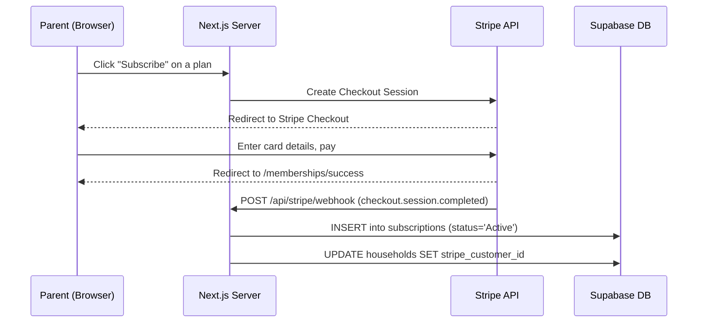

# Stripe Billing + QR Check-in Implementation Plan

## Overview
Wire up Stripe (test mode) for multi-tier membership billing and build a front-desk QR scanner for gym check-in verification.

---

## Phase 1: Stripe Account Setup (YOU do this)

> [!IMPORTANT]
> You need to create a free Stripe account and grab your **test** API keys before I can write any code that talks to Stripe.

### Steps:
1. Go to [https://dashboard.stripe.com/register](https://dashboard.stripe.com/register) and create a free account
2. Once logged in, make sure the **"Test mode"** toggle (top-right) is ON
3. Go to **Developers → API keys** and copy:
   - `Publishable key` → starts with `pk_test_...`
   - `Secret key` → starts with `sk_test_...`
4. Paste them into your `.env.local` file replacing the placeholder values

I'll handle the webhook secret later when we set up the Stripe CLI.

---

## Phase 2: Stripe Products & Checkout (I build this)

### What gets built:
| File | Purpose |
|------|---------|
| `database/seed_membership_plans.sql` | Seed 4 plans: Basic Individual, Basic Family, Premium Individual, Premium Family |
| `src/app/api/stripe/checkout/route.ts` | API route that creates a Stripe Checkout Session |
| `src/app/api/stripe/webhook/route.ts` | Webhook handler that syncs Stripe events → `subscriptions` table |
| `src/app/memberships/page.tsx` | Beautiful membership selection page with pricing cards |
| `src/app/memberships/success/page.tsx` | Post-checkout success page |
| `src/app/memberships/cancel/page.tsx` | Checkout cancelled page |

### Membership Tiers:
| Plan | Price | Covers | `max_dependents` |
|------|-------|--------|-------------------|
| **Basic Individual** (Monthly) | $29.99/mo | 1 person | 0 |
| **Basic Family** (Monthly) | $49.99/mo | Up to 4 household members | 3 |
| **Premium Individual** (Monthly) | $49.99/mo | 1 person + unlimited classes | 0 |
| **Premium Family** (Monthly) | $79.99/mo | Up to 6 household members + unlimited classes | 5 |

### Checkout Flow:


---

## Phase 3: Webhook Sync (I build this)

### Events handled:
| Stripe Event | DB Action |
|-------------|-----------|
| `checkout.session.completed` | Create subscription (Active), set `stripe_customer_id` on household |
| `invoice.paid` | Keep subscription Active |
| `invoice.payment_failed` | Set subscription to Past_Due |
| `customer.subscription.updated` | Sync status changes (cancel, pause) |
| `customer.subscription.deleted` | Set subscription to Cancelled |

### Webhook Testing:
We'll use the **Stripe CLI** to forward webhooks to `localhost:3000`:
```bash
stripe listen --forward-to localhost:3000/api/stripe/webhook
```

---

## Phase 4: QR Code Check-in (I build this)

### What gets built:
| File | Purpose |
|------|---------|
| `src/app/checkin/page.tsx` | Front-desk kiosk page with camera QR scanner |
| `src/app/checkin/[profileId]/page.tsx` | Check-in result page (✅ Allowed / ❌ Denied + reason) |
| `src/app/api/checkin/route.ts` | API that verifies: valid subscription + signed waiver |
| Dashboard QR Code | Each member sees their personal QR code on the dashboard |

### Check-in Verification Logic:
```
1. Scan QR code → extract profile_id
2. Look up profile → find their household
3. Check household subscription status
   - No subscription → ❌ "No Active Pass"
   - Past_Due → ❌ "Payment Due"
   - Cancelled → ❌ "No Active Pass"
   - Active → proceed to step 4
4. Check waiver status
   - No valid waiver → ❌ "Waiver Expired"
   - Valid waiver → ✅ "Success" → INSERT into gym_checkins
5. Display result on screen with member photo/name
```

### QR Code Content:
Each QR code encodes a URL like:
```
https://yoursite.com/checkin/7321a285-3b10-4a6c-8e74-307744ff0547
```
Front desk just scans it and the result page instantly shows ✅ or ❌.

---

## Phase 5: Dashboard Integration

- **Membership Status card**: Show current plan name, next billing date, or "Inactive" with a link to `/memberships`
- **QR Code card**: Show each household member's personal QR code (downloadable)
- **Household card**: Show waiver status + subscription coverage per member

---

## Build Order

1. **Phase 1** — You set up Stripe account & paste test keys
2. **Phase 2** — I build membership plans + checkout flow
3. **Phase 3** — I build webhook handler for subscription sync
4. **Phase 4** — I build QR code check-in system
5. **Phase 5** — I update the dashboard to show everything

> [!TIP]
> Phases 2-5 can be built in ~30 mins once you have your Stripe test keys ready.
